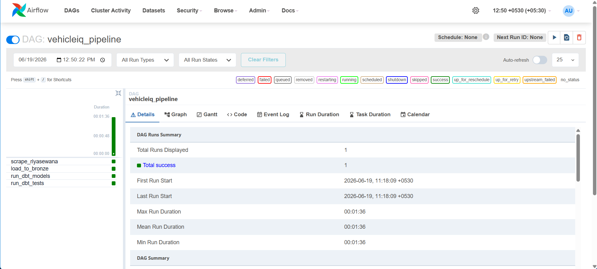
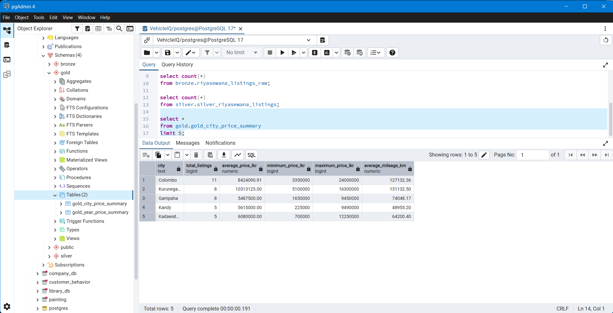

# VehicleIQ Data Platform

## Overview

VehicleIQ is an end-to-end data engineering project that collects vehicle listing data from Riyasewana, stores it in PostgreSQL, transforms it using dbt, and orchestrates the entire workflow using Apache Airflow.

The project follows the Medallion Architecture pattern:

* Bronze Layer – Raw vehicle listing data
* Silver Layer – Cleaned and standardized vehicle data
* Gold Layer – Business-ready analytical tables

This project demonstrates modern data engineering practices including web scraping, ETL pipelines, data modeling, orchestration, testing, containerization, and workflow automation.

---

# Project Screenshots

## Airflow DAG

The Airflow DAG orchestrates the complete workflow from web scraping to data transformation and testing.



## PostgreSQL Medallion Tables

The PostgreSQL database follows the Medallion Architecture pattern using Bronze, Silver, and Gold layers.



---

# Architecture

```text
Riyasewana Website
        ↓
Python Scraper
        ↓
CSV File
        ↓
PostgreSQL Bronze Layer
        ↓
dbt Silver Layer
        ↓
dbt Gold Layer
        ↓
dbt Tests
        ↓
Apache Airflow
```

---

# Technologies Used

* Python
* PostgreSQL
* SQL
* dbt
* Apache Airflow
* Docker
* Pandas
* BeautifulSoup
* SQLAlchemy
* uv

---

# Project Structure

```text
VehicleIQ-Data-Platform/
│
├── airflow/
│   └── dags/
│       └── vehicleiq_pipeline.py
│
├── data/
│
├── dbt_vehicleiq/
│   ├── models/
│   │   ├── silver/
│   │   └── gold/
│   ├── macros/
│   ├── seeds/
│   └── tests/
│
├── loaders/
│   └── load_to_postgres.py
│
├── scrapers/
│   └── scrape_riyasewana.py
│
├── docs/
│   └── images/
│       ├── airflow_dag.png
│       └── postgres_tables.png
│
├── Dockerfile
├── docker-compose.yml
├── pyproject.toml
├── uv.lock
├── .gitignore
└── README.md
```

---

# Medallion Architecture

## Bronze Layer

The Bronze layer stores raw data exactly as it is collected from the source.

Example table:

```sql
bronze.riyasewana_listings_raw
```

Purpose:

* Preserve source data
* Enable auditing
* Support reprocessing

---

## Silver Layer

The Silver layer cleans and standardizes raw data.

Example table:

```sql
silver.silver_riyasewana_listings
```

Transformations include:

* Price cleaning
* Mileage cleaning
* Data type conversion
* Null handling
* Standardized columns

Purpose:

* Improve data quality
* Create reusable datasets

---

## Gold Layer

The Gold layer contains business-ready analytical tables.

Examples:

```sql
gold.gold_city_price_summary
gold.gold_year_price_summary
```

Purpose:

* Reporting
* Analytics
* Dashboarding
* Business insights

---

# Airflow Pipeline

The pipeline is orchestrated using Apache Airflow.

Workflow:

```text
scrape_riyasewana
        ↓
load_to_bronze
        ↓
run_dbt_models
        ↓
run_dbt_tests
```

## scrape_riyasewana

Scrapes vehicle listings from Riyasewana and stores the results as a CSV file.

## load_to_bronze

Loads the scraped CSV into PostgreSQL Bronze tables.

## run_dbt_models

Builds Silver and Gold models using dbt.

## run_dbt_tests

Runs data quality checks such as:

* Not Null tests
* Unique tests

---

# Data Quality Testing

dbt tests are used to ensure data quality.

Examples:

```yaml
- unique
- not_null
```

Current validations include:

* listing_url must be unique
* listing_url must not be null
* title must not be null

---

# Docker

Docker is used to provide a reproducible environment.

Benefits:

* Consistent execution
* Easy deployment
* Simplified setup
* Portable environment

Main files:

```text
Dockerfile
docker-compose.yml
```

---

# Running the Project

## 1. Clone Repository

```bash
git clone https://github.com/AkillerKavinda/VehicleIQ-Data-Platform.git
cd VehicleIQ-Data-Platform
```

## 2. Start Airflow

```bash
docker compose up --build -d
```

## 3. Open Airflow

```text
http://localhost:8080
```

## 4. Trigger Pipeline

Run:

```text
vehicleiq_pipeline
```

Airflow will execute:

```text
scrape_riyasewana
        ↓
load_to_bronze
        ↓
run_dbt_models
        ↓
run_dbt_tests
```

---

# Example Analytics

Average vehicle prices by city:

```sql
select *
from gold.gold_city_price_summary;
```

Average vehicle prices by year:

```sql
select *
from gold.gold_year_price_summary;
```

---

# Learning Outcomes

This project demonstrates:

* Web scraping with Python
* PostgreSQL data warehousing
* Medallion Architecture
* Data transformation using dbt
* Data quality testing
* Workflow orchestration with Airflow
* Docker containerization
* End-to-end ETL pipeline development

---

# Future Improvements

* Incremental loading
* PostgreSQL containerization
* Dashboard development
* CI/CD pipeline
* Cloud deployment
* Data lineage documentation
* Additional Gold analytical models

---

# Author

**Akila Kavinda**
